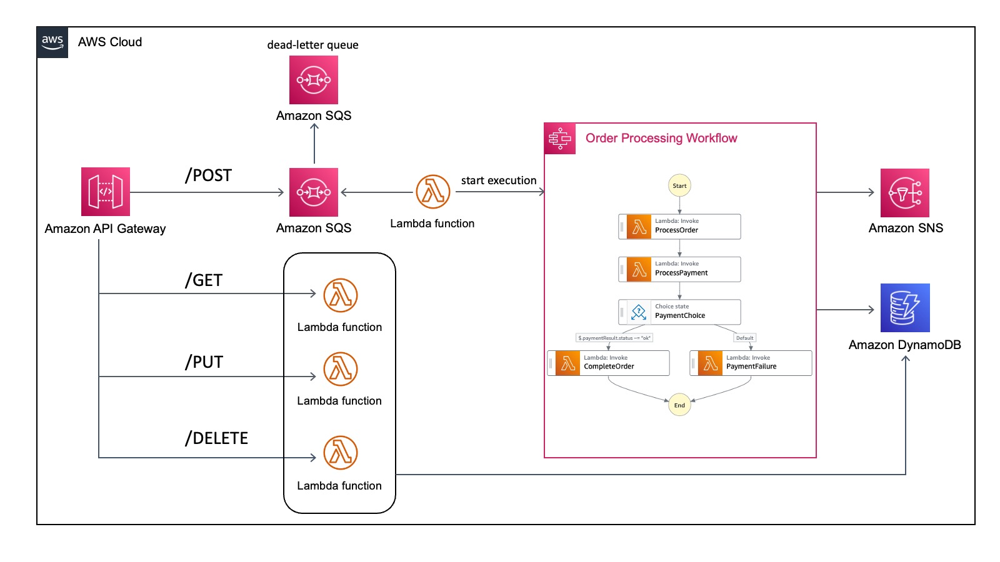

# SAM Accelerate nested stack demo

This repository shows how to use [CloudFormation nested
stacks](https://docs.aws.amazon.com/AWSCloudFormation/latest/UserGuide/using-cfn-nested-stacks.html)
with
[AWS SAM Accelerate](https://docs.aws.amazon.com/serverless-application-model/latest/developerguide/accelerate.html).

## Overview

There are four separate stacks that make up the entire solution. AWS SAM manages all four as
CloudFormation nested stacks. During development, we show how to use SAM Accelerate to quickly
update resources, shortening the development loop.

- `api`: Public-facing API Gateway endpoint
- `api-integrations`: Defines Lambda functions, SQS queue and other supporting resources
- `db`: DynamoDB table
- `workflow`: Defines the order processing Step Functions workflow and supporting Lambda functions



> **Note:**
> SAM Accelerate is a capability to leverage during the development process. When deploying
> production applications you should _not_ use SAM Accelerate but the other facilities SAM provides
> in a CI/CD pipeline.

## Getting started

Follow these steps to see how SAM Accelerate works with nested stacks. This shows how you can
shorten the build/test/deploy loop when developing serverless applications with SAM.

1. Deploy the project
1. Start a SAM Accelerate session with `sam sync --watch`
1. Make code or infrastructure changes to see how SAM intelligently syncs the changed resources.

## Deploy the project

To start, deploy the project using SAM:

```bash
sam build && sam deploy --guided --capabilities CAPABILITY_IAM CAPABILITY_AUTO_EXPAND
```

### Run SAM Accelerate

Once you have deployed your project, start SAM Accelerate with the `sam sync` command. Note that the
`--stack-name` argument depends on what you named your stack and you may need to adjust:

```bash
sam sync --watch --stack-name orders-app
```

### Make a code change

Change a single file. For example, change the `Subject` parameter in the `send_order_notification`
function in the `workflow/src/complete_order/app.py` file.

Note how SAM updates the Lambda function but does _not_ run a full CloudFormation update. Because
other stacks are unmodified, SAM does not update them. SAM also knows that updating the Lambda
function does not require a CloudFormation build.

### Make an infrastructure change

Now change a file which affects an AWS resource. In the `db/template.yaml` file, change
`ReadCapacityUnits` and `WriteCapacityUnits` from `5` to `1`:

```yaml
ProvisionedThroughput:
  ReadCapacityUnits: 1
  WriteCapacityUnits: 1
```

Note how SAM runs a CloudFormation build _only_ for the `db` stack. SAM skips other stacks since you
did not update resources in them. Whenever you change infrastructure, SAM will run a CloudFormation
build to update the changed resources.

## Testing the API

It's unnecessary to test the API in order to take advantage of SAM Accelerate in this repository.
If you would like to see the full solution work, read below.

## Resources / Methods

```
/orders: create/list orders
  - POST: create new >>APIGW>>SQS>>LAMBDA>>SFN
  - GET: list all >>APIGW>>LAMBDA>>DDB
/orders/{orderId}+: list/update/delete
  - GET: single order >>APIGW>>LAMBDA>>DDB
  - PUT: update order fields >>APIGW>>LAMBDA>>DDB
  - DELETE: cancel >>APIGW>>LAMBDA>>DDB
```

## Create New Order: Request Body

```json
{
  "quantity": 5,
  "name": "Rellenos",
  "restaurantId": "San Miguels"
}
```

## Response

```json
{
  "SendMessageResponse": {
    "ResponseMetadata": {
      "RequestId": "149645e0-4a90-5d4f-b803-1ed00b1d3070"
    },
    "SendMessageResult": {
      "MD5OfMessageAttributes": null,
      "MD5OfMessageBody": "f7fa30aea056604470797e60af6b7b7d",
      "MD5OfMessageSystemAttributes": null,
      "MessageId": "459a1908-1f2f-44db-a9f8-137ee3cf8333",
      "SequenceNumber": null
    }
  }
}
```

## List all orders request / response

```bash
curl https://m9wpqruuwk.execute-api.us-east-1.amazonaws.com/Dev/orders/ | python -
m json.tool
```

```json
[
  {
    "quantity": {
      "N": "5"
    },
    "user_id": {
      "S": "demo_user"
    },
    "orderStatus": {
      "S": "SUCCESS"
    },
    "createdAt": {
      "S": "2022-06-24T21:14:08.400232"
    },
    "id": {
      "S": "0946ee2d-3be4-40bd-a44c-a0508adbd530"
    },
    "name": {
      "S": "El Presidente"
    },
    "restaurantId": {
      "S": "San Miguels"
    }
  },
  {
    "quantity": {
      "N": "1"
    },
    "user_id": {
      "S": "demo_user"
    },
    "orderStatus": {
      "S": "FAILED"
    },
    "createdAt": {
      "S": "2022-06-24T22:48:46.651168"
    },
    "errorMessage": {
      "S": "payment method declined"
    },
    "id": {
      "S": "459a1908-1f2f-44db-a9f8-137ee3cf8333"
    },
    "name": {
      "S": "Moo Goo Gai Pan"
    },
    "restaurantId": {
      "S": "Main Moon"
    }
  },
  {
    "quantity": {
      "N": "1"
    },
    "user_id": {
      "S": "demo_user"
    },
    "orderStatus": {
      "S": "PENDING"
    },
    "createdAt": {
      "S": "2022-06-24T21:07:01.660777"
    },
    "id": {
      "S": "7bb585ba-9d0c-42f8-87ad-3a0fabdbb7a1"
    },
    "name": {
      "S": "El Presidente"
    },
    "restaurantId": {
      "S": "San Miguels"
    }
  },
  {
    "quantity": {
      "N": "1"
    },
    "user_id": {
      "S": "demo_user"
    },
    "orderStatus": {
      "S": "FAILED"
    },
    "createdAt": {
      "S": "2022-06-24T21:12:21.649437"
    },
    "errorMessage": {
      "S": "payment method declined"
    },
    "id": {
      "S": "cbaee64b-3f6b-42af-aa06-87ad2da321b2"
    },
    "name": {
      "S": "El Presidente"
    },
    "restaurantId": {
      "S": "San Miguels"
    }
  }
]
```

## Security

See [CONTRIBUTING](CONTRIBUTING.md#security-issue-notifications) for more information.

## License

This library is licensed under the MIT-0 License. See the LICENSE file.
